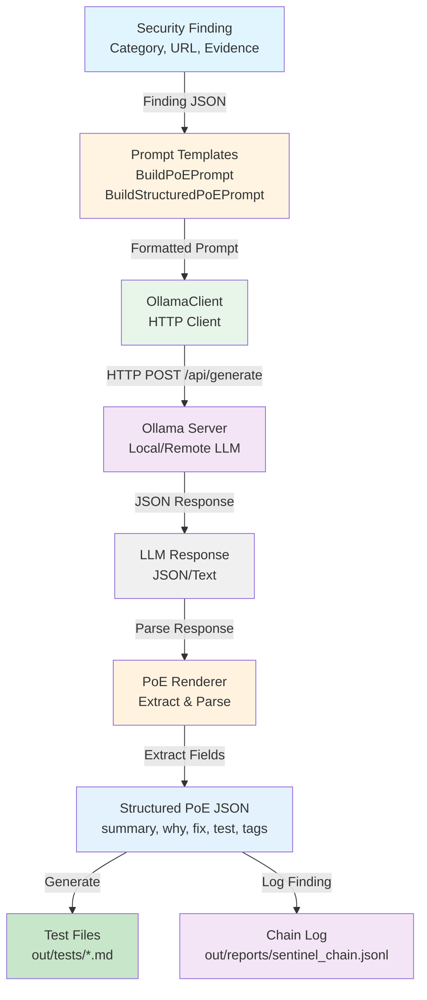

# Sentinel LLM Integration

Sentinel integrates with Large Language Models (LLMs) via Ollama to enhance security testing with intelligent test variation generation and Proof-of-Exploit (PoE) explanations. This integration brings AI-powered intelligence to the vulnerability detection process, transforming raw security findings into actionable insights that help developers understand, reproduce, and fix security issues more effectively.

## Overview

The LLM module serves as an intelligent augmentation layer for Sentinel's vulnerability detection engine. Rather than simply reporting that a vulnerability exists, the LLM integration provides context-aware explanations, generates diverse test cases, and produces human-readable documentation that bridges the gap between automated security scanning and developer remediation workflows.

The LLM module enhances Sentinel's vulnerability detection by:
- **Generating test variations**: Creating diverse payloads and test cases from discovered inputs. When Sentinel's crawler discovers a form field or API parameter, the LLM can generate multiple test variations beyond simple payload injection, including edge cases, encoding variations, and context-specific attack vectors that might be missed by static payload lists.
- **Proof-of-Exploit (PoE) generation**: Producing human-readable explanations with remediation steps. Each security finding is transformed into a comprehensive explanation that includes why the vulnerability matters, how to reproduce it, what the security impact is, and step-by-step remediation guidance. This transforms technical findings into actionable developer documentation.
- **Safety scoring**: Evaluating input safety before testing. Before executing potentially dangerous payloads, the LLM can evaluate whether an input appears safe or potentially harmful, helping to prevent false positives and reduce unnecessary testing overhead.

## Architecture

The LLM integration follows a modular design that separates concerns between prompt engineering, LLM communication, response parsing, and output generation. This architecture ensures that the LLM functionality can be easily extended, tested independently, and integrated seamlessly with Sentinel's existing vulnerability detection pipeline.

The following diagram illustrates how the LLM module integrates with Sentinel's scanning pipeline:



**Data Flow:**

The LLM integration follows a clear pipeline that transforms raw security findings into enriched, actionable documentation:

1. **Security Finding** is detected by Sentinel's vulnerability engine. This finding contains essential information such as the vulnerability category, affected URL, HTTP method, and evidence that triggered the detection. This raw finding serves as the input seed for LLM processing.

2. **Prompt Templates** format the finding into a structured prompt for the LLM. The prompt templates are carefully engineered to provide the LLM with context about the vulnerability type, the specific evidence found, and the desired output format. Different templates are used for different purposes: basic PoE generation, structured JSON PoE, and safety scoring.

3. **OllamaClient** sends HTTP request to Ollama server. The client handles all the low-level HTTP communication, including connection management, timeout handling, retry logic, and error recovery. It abstracts away the complexity of communicating with the Ollama API, providing a clean interface for the rest of the system.

4. **Ollama Server** processes prompt and generates response. The Ollama server runs the selected LLM model (such as llama3.2 or llama3.1) and generates a response based on the prompt. The server can run locally or remotely, making it flexible for different deployment scenarios.

5. **LLM Response** is parsed and validated. The raw response from the LLM may come in various formats (direct JSON, Ollama-wrapped JSON, or plain text), so the system must parse and validate the response to ensure it contains the expected information.

6. **PoE Renderer** extracts structured fields (summary, why, fix, test, tags). The renderer intelligently extracts the key components of a Proof-of-Exploit from the LLM response, handling various response formats gracefully. It identifies the summary, explanation, remediation steps, test instructions, and security tags (CWE, OWASP categories).

7. **Structured PoE** is used to generate test files and log to chain. The final structured PoE is then integrated into Sentinel's output pipeline, generating markdown test files that developers can use to reproduce vulnerabilities, and logging the enriched finding to the tamper-evident chain log for audit purposes.

## File Interaction Diagram

Understanding how the LLM module fits into the broader Sentinel architecture is crucial for developers who want to extend or customize the LLM functionality. The following diagram shows how all relevant source files interact with each other in the Sentinel codebase, illustrating the dependencies, data flows, and integration points between the LLM components and the rest of the system.



```mermaid
graph TB
    subgraph "Main Entry Points"
        Main[src/main.cpp<br/>Main Scanner]
        LLMMain[apps/llm/main.cpp<br/>LLM CLI Tool]
        SentinelLLM[src/sentinel_llm.cpp<br/>LLM Pipeline]
    end

    subgraph "Core Components"
        HttpClient[src/core/http_client.cpp<br/>HTTP Client<br/>libcurl wrapper]
        Crawler[src/core/crawler.cpp<br/>Web Crawler<br/>Link/Form Discovery]
        VulnEngine[src/core/vuln_engine.cpp<br/>Vulnerability Engine<br/>Security Analysis]
        SessionMgr[src/core/session_manager.cpp<br/>Session Manager<br/>Authentication]
    end

    subgraph "Analysis Modules"
        ResponseAnalyzer[src/core/response_analyzer.cpp<br/>Response Analyzer<br/>Pattern Detection]
        TimingAnalyzer[src/core/timing_analyzer.cpp<br/>Timing Analyzer<br/>Blind Injection]
        BaselineComp[src/core/baseline_comparator.cpp<br/>Baseline Comparator<br/>Behavioral Analysis]
    end

    subgraph "LLM Components"
        OllamaClient[src/llm/ollama_client.h<br/>Ollama Client<br/>HTTP Client for LLM]
        PromptTemplates[src/llm/prompt_templates.h<br/>Prompt Templates<br/>PoE Generation]
        PoERenderer[src/llm/poe_renderer.h<br/>PoE Renderer<br/>Response Parsing]
    end

    subgraph "Supporting Libraries"
        ChainLogger[src/logging/chain.cpp<br/>Chain Logger<br/>Tamper-Evident Logging]
        Artifacts[src/artifacts/artifacts.cpp<br/>Artifacts Generator<br/>Repro Scripts]
        Policy[src/budget/policy.cpp<br/>Policy Engine<br/>Risk Scoring]
    end

    subgraph "Schema"
        FindingSchema[schema/finding.h<br/>Finding Schema]
        CrawlSchema[schema/crawl_result.h<br/>Crawl Result Schema]
    end

    subgraph "Configuration"
        AuthConfig[config/auth_config.yaml<br/>Auth Configuration]
        PolicyConfig[config/policy.yaml<br/>Risk Policy]
        PatternConfig[config/response_patterns.yaml<br/>Pattern Config]
    end

    %% Main flow
    Main --> HttpClient
    Main --> Crawler
    Main --> VulnEngine
    Main --> ChainLogger
    Main --> Artifacts
    Main --> Policy

    %% Crawler dependencies
    Crawler --> HttpClient
    Crawler --> CrawlSchema

    %% VulnEngine dependencies
    VulnEngine --> HttpClient
    VulnEngine --> SessionMgr
    VulnEngine --> ResponseAnalyzer
    VulnEngine --> TimingAnalyzer
    VulnEngine --> BaselineComp
    VulnEngine --> FindingSchema
    VulnEngine --> CrawlSchema

    %% Analysis module dependencies
    ResponseAnalyzer --> PatternConfig
    TimingAnalyzer --> HttpClient
    BaselineComp --> ResponseAnalyzer
    BaselineComp --> HttpClient

    %% Session manager dependencies
    SessionMgr --> HttpClient
    SessionMgr --> AuthConfig

    %% LLM flow
    LLMMain --> OllamaClient
    SentinelLLM --> OllamaClient
    OllamaClient --> PromptTemplates
    PromptTemplates --> PoERenderer
    PoERenderer --> Artifacts
    PoERenderer --> ChainLogger

    %% Configuration dependencies
    VulnEngine -.->|reads| PolicyConfig
    SessionMgr -.->|reads| AuthConfig
    ResponseAnalyzer -.->|reads| PatternConfig

    %% Artifacts dependencies
    Artifacts --> FindingSchema
    Artifacts --> ChainLogger

    %% Policy dependencies
    Policy -.->|reads| PolicyConfig

    style Main fill:#e1f5ff
    style VulnEngine fill:#fff3e0
    style HttpClient fill:#fff4e1
    style Crawler fill:#e8f5e9
    style SessionMgr fill:#f3e5f5
    style ResponseAnalyzer fill:#e3f2fd
    style TimingAnalyzer fill:#e3f2fd
    style BaselineComp fill:#e3f2fd
    style OllamaClient fill:#c8e6c9
    style ChainLogger fill:#f3e5f5
    style Artifacts fill:#fff4e1
    style Policy fill:#fff4e1
```

**Key Interactions:**

The Sentinel codebase follows a layered architecture where each component has clear responsibilities and well-defined interfaces. Understanding these interactions helps developers navigate the codebase and understand how to extend functionality:

1. **Main Scanner Flow** (`src/main.cpp`):
   - Orchestrates the entire scanning process from start to finish. This is the entry point that coordinates all other components, managing the lifecycle of a security scan from initial target discovery through final reporting.
   - Uses `Crawler` to discover endpoints, forms, and API routes by following links, parsing HTML, and analyzing JavaScript. The crawler builds a comprehensive map of the target application's attack surface.
   - Passes results to `VulnEngine` for analysis. The vulnerability engine receives all discovered endpoints and applies various security checks to identify vulnerabilities.
   - Uses `ChainLogger` to log findings in a tamper-evident format. Every finding is logged to a hash-chained log file that ensures integrity and provides an audit trail.
   - Uses `Artifacts` to generate reproduction scripts. For each finding, the artifacts generator creates executable test scripts that developers can use to reproduce and verify vulnerabilities.
   - Uses `Policy` to evaluate risk scores. The policy engine applies configurable risk scoring rules to determine the severity and impact of each finding, enabling risk-based prioritization.

2. **Vulnerability Engine** (`src/core/vuln_engine.cpp`):
   - Central component that coordinates all vulnerability checks. The vulnerability engine acts as the orchestrator for all security tests, managing the flow of requests and responses through various detection modules.
   - Uses `HttpClient` for making test requests. All HTTP communication goes through a centralized HTTP client that handles connection pooling, retries, and error handling.
   - Uses `SessionMgr` for authenticated requests. When scanning protected endpoints, the session manager maintains authentication state and injects necessary cookies and headers.
   - Delegates to specialized analyzers (`ResponseAnalyzer`, `TimingAnalyzer`, `BaselineComp`). Each analyzer focuses on a specific detection technique: pattern matching, timing analysis, or behavioral comparison.
   - Reads configuration from `config/policy.yaml`. Risk scoring rules, severity thresholds, and detection policies are configured via YAML files for easy customization.

3. **Analysis Modules**:
   - **ResponseAnalyzer**: Detects patterns in HTTP responses (SQL errors, stack traces, etc.). This module uses regex patterns and heuristics to identify vulnerability indicators in response bodies, headers, and status codes. It can detect SQL injection errors, command execution output, information disclosure, and more.
   - **TimingAnalyzer**: Detects blind injection via timing analysis. Some vulnerabilities don't produce visible errors but cause measurable delays. This analyzer establishes baseline response times and detects anomalies that indicate time-based SQL injection or command injection vulnerabilities.
   - **BaselineComp**: Compares responses to detect behavioral anomalies. By comparing normal responses with test responses, this module can identify vulnerabilities that don't produce explicit error messages but alter application behavior in detectable ways.
   - All use `HttpClient` for making requests. The shared HTTP client ensures consistent request handling, timeout management, and error recovery across all analysis modules.

4. **Session Management**:
   - `SessionMgr` uses `HttpClient` for authentication requests. When configured, the session manager performs login operations, extracts session tokens, and maintains authenticated sessions throughout the scan.
   - Reads credentials from `config/auth_config.yaml`. Authentication configuration is externalized to YAML files, supporting multiple users, different authentication types (form-based, API keys, OAuth), and role-based testing scenarios.
   - Injects cookies/headers into requests for `VulnEngine`. Once authenticated, the session manager automatically injects session cookies and authorization headers into all vulnerability test requests, enabling comprehensive testing of protected endpoints.

5. **LLM Integration**:
   - `OllamaClient` communicates with Ollama server. This client handles all communication with the Ollama API, managing HTTP requests, handling timeouts, and providing retry logic. It abstracts away the complexity of LLM communication, making it easy to swap LLM providers if needed.
   - `PromptTemplates` formats findings into prompts. The prompt templates are carefully crafted to provide the LLM with the right context and structure. Different templates are used for different purposes: generating PoE explanations, creating test variations, or evaluating input safety.
   - `PoERenderer` parses LLM responses. LLM responses can come in various formats, so the renderer intelligently extracts structured information from the response, handling different JSON structures and plain text fallbacks gracefully.
   - Results feed into `Artifacts` and `ChainLogger`. The enriched findings from the LLM are integrated back into Sentinel's output pipeline, generating test files and audit logs that include the AI-generated explanations and remediation guidance.

6. **Data Flow**:
   - `Crawler` produces `CrawlResult` objects. The crawler discovers endpoints, forms, and parameters, packaging them into structured `CrawlResult` objects that contain URLs, HTTP methods, parameters, headers, and other metadata needed for vulnerability testing.
   - `VulnEngine` analyzes and produces `Finding` objects. Each security check performed by the vulnerability engine produces a `Finding` object that contains the vulnerability category, affected URL, evidence, confidence score, and severity level.
   - `Artifacts` generates test files from findings. The artifacts generator takes findings (optionally enriched by the LLM) and produces executable test scripts, markdown documentation, and reproduction instructions that developers can use to verify and fix vulnerabilities.
   - `ChainLogger` creates tamper-evident logs. Every finding is logged to a hash-chained log file where each entry includes a hash of the previous entry, ensuring that any modification to the log can be detected. This provides an immutable audit trail for compliance and security purposes.
   - `Policy` evaluates risk scores from findings. The policy engine applies configurable scoring rules to calculate risk scores for findings, enabling organizations to set risk budgets and implement CI/CD gating based on cumulative risk scores.

## Installation

Setting up the LLM integration requires installing Ollama (the LLM runtime) and downloading a compatible language model. Ollama provides a lightweight, local LLM runtime that runs models efficiently on your machine without requiring cloud services or API keys. This makes it ideal for security testing scenarios where you want to keep sensitive vulnerability data local and avoid external API dependencies.

### Prerequisites

- Ollama installed and running. Ollama serves as the runtime environment for running LLM models locally. It provides a simple HTTP API that Sentinel uses to communicate with the models.
- A compatible LLM model (e.g., `llama3.2:3b-instruct-q4_0`, `llama3.1:8b`). You'll need to download at least one model that Ollama can run. Smaller models are faster but may produce lower-quality output, while larger models provide better explanations but require more memory and processing time.

### Install Ollama

**macOS/Linux:**
```bash
curl -fsSL https://ollama.ai/install.sh | sh
```

**Windows:**
Download from https://ollama.ai/download

### Pull a Model

```bash
# Small, fast model (recommended for testing)
ollama pull llama3.2:3b-instruct-q4_0

# Larger, more capable model
ollama pull llama3.1:8b

# Alternative models
ollama pull mistral
ollama pull codellama
```

### Start Ollama Server

```bash
ollama serve
```

The server runs on `http://127.0.0.1:11434` by default.

### Configure Host

If your Ollama server is on a different host/port:

```bash
export OLLAMA_HOST=http://192.168.1.100:11434
```

## Usage

The LLM integration can be used in several ways: as a standalone command-line tool for testing and experimentation, as part of the full Sentinel scanning pipeline for automatic PoE generation, or programmatically through the C++ API for custom integrations. Each usage mode serves different purposes and provides different levels of control over the LLM interaction.

### Command-Line Tool

The `sentinel_llm` CLI tool provides direct access to LLM functionality, allowing you to test LLM connectivity, experiment with prompts, and generate PoE explanations manually. This tool is useful for debugging LLM integration issues, testing different models, and understanding how the LLM responds to different types of security findings:

```bash
# Basic text generation
./build/apps/llm/sentinel_llm --model llama3.2:3b-instruct-q4_0 --prompt "Hello, world!"

# JSON output
./build/apps/llm/sentinel_llm --model llama3.2:3b-instruct-q4_0 --prompt "Generate a curl command" --json

# Custom timeout
./build/apps/llm/sentinel_llm --model llama3.2:3b-instruct-q4_0 --prompt "Test" --timeout-ms 30000
```

### Proof-of-Exploit Generation

The LLM module's primary value lies in its ability to transform raw security findings into comprehensive, human-readable Proof-of-Exploit documentation. When Sentinel detects a vulnerability, the LLM integration can automatically generate a detailed explanation that includes context about why the vulnerability matters, how to reproduce it, what the security impact is, and step-by-step remediation guidance. This transforms technical security findings into actionable developer documentation that speeds up the remediation process.

The LLM module generates structured PoE explanations for security findings:

**Input (Finding JSON):**
```json
{
  "category": "missing_security_header",
  "url": "http://127.0.0.1:8080/",
  "method": "GET",
  "evidence": {
    "header_checked": "X-Frame-Options"
  }
}
```

**Output (Structured PoE):**
```json
{
  "summary": "Missing X-Frame-Options header",
  "why": "The API endpoint is vulnerable to Clickjacking attacks because it doesn't include the X-Frame-Options header",
  "fix": "Add the X-Frame-Options header with a value of 'DENY' to prevent clickjacking attacks",
  "test": "- Send request without X-Frame-Options header\n- Add X-Frame-Options header and send request\n- Verify response headers include X-Frame-Options",
  "tags": {
    "cwe": "CWE-693",
    "owasp": "A05: Security Misconfiguration"
  }
}
```

### Integration with Full Demo

The full demo script (`./tools/full_demo.sh`) includes LLM smoke tests:

```bash
./tools/full_demo.sh
```

This runs:
1. **LLM Smoke Test** - Basic connectivity check
2. **PoE Smoke Test** - Generates PoE for a sample finding
3. **Scanner Integration** - Uses LLM for test variation generation

## API Reference

The LLM integration provides a clean C++ API that abstracts away the complexity of communicating with LLM models. The API is designed to be simple to use while providing enough flexibility for advanced use cases. All components are well-documented and follow consistent patterns, making it easy to integrate LLM functionality into custom tools or extend Sentinel's capabilities.

### OllamaClient

The `OllamaClient` class is the primary interface for communicating with Ollama servers. It handles HTTP communication, timeout management, retry logic, and error handling, providing a simple API for generating text using LLM models. The client automatically reads the `OLLAMA_HOST` environment variable if no host is specified, making it easy to configure for different deployment scenarios.

Located in `src/llm/ollama_client.h`:

```cpp
class OllamaClient {
public:
    // Constructor - reads OLLAMA_HOST env var if host empty
    explicit OllamaClient(const std::string& host = "");

    // Check if server is reachable
    bool IsHealthy();

    // Generate text using specified model
    std::string Generate(
        const std::string& model,
        const std::string& prompt,
        const std::optional<nlohmann::json>& json_schema = std::nullopt,
        const std::chrono::milliseconds& timeout = std::chrono::milliseconds(5000),
        bool stream = false
    );
};
```

**Example:**
```cpp
#include "llm/ollama_client.h"

llm::OllamaClient client;
if (!client.IsHealthy()) {
    std::cerr << "Ollama server not reachable\n";
    return;
}

std::string response = client.Generate(
    "llama3.2:3b-instruct-q4_0",
    "Generate a curl command to test XSS",
    std::nullopt,
    std::chrono::milliseconds(10000)
);
```

### Prompt Templates

Prompt engineering is crucial for getting high-quality output from LLMs. The prompt templates in Sentinel are carefully crafted to provide the LLM with the right context, structure, and instructions for generating useful security documentation. Different templates are used for different purposes: basic PoE generation produces simple explanations, structured PoE generation produces JSON-formatted output with specific fields, and safety scoring evaluates input safety before testing.

Located in `src/llm/prompt_templates.h`:

**BuildPoEPrompt** - Creates prompt for basic PoE generation:
```cpp
std::string prompt = llm::BuildPoEPrompt(finding_json);
```

**BuildStructuredPoEPrompt** - Creates prompt for structured JSON PoE:
```cpp
std::string prompt = llm::BuildStructuredPoEPrompt(finding_json);
```

**BuildSafetyScorePrompt** - Creates prompt for safety scoring:
```cpp
std::string prompt = llm::BuildSafetyScorePrompt(input_snippet);
```

### PoE Renderer

LLM responses can come in various formats depending on the model and how the prompt was structured. The PoE renderer intelligently parses these different response formats, extracting structured information regardless of whether the response is direct JSON, Ollama-wrapped JSON, or plain text. This flexibility ensures that the LLM integration works reliably across different models and response formats.

Located in `src/llm/poe_renderer.h`:

**RenderPoE** - Extracts PoE command from LLM response:
```cpp
std::string poe_command = llm::RenderPoE(llm_response_json);
```

Handles various response formats:
- Direct JSON with `reproducer` field
- Ollama format with nested `response` field
- Plain text fallback

## Configuration

Proper configuration of timeouts, retry policies, and model selection is essential for reliable LLM integration. Different models have different response times, and network conditions can vary, so Sentinel provides flexible configuration options to adapt to different environments and use cases.

### Timeouts

LLM responses can take varying amounts of time depending on the model size, prompt complexity, and system load. Sentinel uses configurable timeouts to prevent hanging on slow responses while allowing enough time for complex prompts to complete. Default timeout is 5 seconds, which works well for small models and simple prompts, but you may need to increase this for larger models or more complex PoE generation tasks.

Configure via CLI:

```bash
--timeout-ms 30000  # 30 seconds
```

Or programmatically:

```cpp
client.Generate(model, prompt, std::nullopt, std::chrono::milliseconds(30000));
```

### Adaptive Timeouts

The client uses adaptive timeouts:
- **Connection timeout**: 5 seconds
- **Write timeout**: 30 seconds
- **Read timeout**: `max(timeout_opt, 10s)` or 30s default

### Retries

Default retry policy:
- **Max retries**: 1
- **Retry on**: Connection failures only
- **No retry on**: Read/write timeouts, HTTP errors

## Error Handling

Robust error handling is essential when working with LLMs, as network issues, model unavailability, and timeout conditions are common. Sentinel's LLM client provides clear error messages and consistent error handling patterns, making it easy to diagnose issues and implement appropriate fallback behavior when LLM functionality is unavailable.

The client throws `std::runtime_error` on:

- **Connection failures**: "ollama: connection failure"
- **Read timeouts**: "ollama: read timeout"
- **Write timeouts**: "ollama: write timeout"
- **HTTP errors**: "ollama: HTTP 404" (for status >= 400)
- **Request canceled**: "ollama: request canceled"

**Example:**
```cpp
try {
    std::string response = client.Generate(model, prompt);
} catch (const std::runtime_error& e) {
    std::cerr << "LLM error: " << e.what() << "\n";
}
```

## Testing

Comprehensive testing ensures that the LLM integration works correctly across different scenarios, models, and response formats. Sentinel includes unit tests for individual components, integration tests for the full pipeline, and smoke tests that verify basic functionality without requiring extensive setup.

### Unit Tests

The unit tests verify that individual components work correctly in isolation, testing prompt generation, response parsing, and error handling. These tests can run without an actual Ollama server, using mocked responses to verify parsing logic and error handling.

Run LLM-specific tests:

```bash
# Run all LLM tests
ctest -R "(ollama|poe|llm)" -V

# Run specific test binary
./build/test_ollama_client -r console -s
./build/test_poe_renderer -r console -s
```

### Smoke Tests

The demo script includes smoke tests:

```bash
./tools/full_demo.sh
```

**Expected output:**
```
=== LLM Smoke Test ===
{
  "response": "Sentinel LLM OK"
}

=== PoE Smoke Test ===
Finding: Missing X-Frame-Options header
Why: The API endpoint is vulnerable to Clickjacking attacks...
Fix: Add the X-Frame-Options header with a value of 'DENY'...
Test: - Send request without X-Frame-Options header...
CWE: CWE-693 | OWASP: A05: Security Misconfiguration
```

## Troubleshooting

### "Ollama not reachable"

**Check if Ollama is running:**
```bash
curl http://127.0.0.1:11434/api/tags
```

**Start Ollama:**
```bash
ollama serve
```

**Check environment variable:**
```bash
echo $OLLAMA_HOST
export OLLAMA_HOST=http://127.0.0.1:11434
```

### "Model not found"

**List available models:**
```bash
ollama list
```

**Pull the model:**
```bash
ollama pull llama3.2:3b-instruct-q4_0
```

### "Read timeout"

**Increase timeout:**
```bash
./build/apps/llm/sentinel_llm --model llama3.2:3b-instruct-q4_0 --prompt "..." --timeout-ms 30000
```

**Check model size:** Smaller models respond faster. Consider using `llama3.2:3b-instruct-q4_0` instead of larger models.

### "Invalid JSON response"

The PoE renderer handles various response formats. If you see JSON parsing errors:

1. Check LLM response format matches expected structure
2. Verify model supports JSON output
3. Check prompt template includes JSON structure instructions

### "Connection refused"

**Check firewall/network:**
```bash
# Test connectivity
curl -v http://127.0.0.1:11434/api/tags

# Check if port is listening
netstat -an | grep 11434  # Linux
lsof -i :11434             # macOS
```

## Limitations

Like any technology, the LLM integration has limitations that users should be aware of when designing their security testing workflows. Understanding these limitations helps set appropriate expectations and guides decisions about when and how to use LLM functionality.

- **No streaming support**: The `stream` parameter exists but streaming responses are not fully implemented. This means you must wait for the complete response before processing, which can be slower for long responses but simplifies error handling and response parsing.

- **JSON schema support**: Depends on Ollama model capabilities. While Sentinel requests structured JSON output, not all models support strict JSON schema validation. The PoE renderer handles various response formats gracefully, but you may need to experiment with different models to find one that produces consistently structured output.

- **Single request/response**: No conversation context maintained between requests. Each LLM call is independent, so the LLM doesn't remember previous findings or build up context across multiple vulnerabilities. This keeps the system simple and stateless but means you can't have multi-turn conversations or build up context over time.

- **Model dependency**: Quality of PoE generation depends on the selected model. Smaller models are faster and use less memory but may produce lower-quality explanations. Larger models provide better output but require more resources. You'll need to balance speed, quality, and resource usage based on your specific needs.

## Best Practices

Following best practices ensures reliable, efficient, and maintainable LLM integration. These recommendations are based on real-world usage patterns and help avoid common pitfalls when working with LLMs in production security testing environments.

1. **Use appropriate models**: Smaller models (`llama3.2:3b-instruct-q4_0`) for fast testing, larger models for better quality. Start with smaller models for development and testing, then move to larger models for production if you need higher-quality PoE generation. Consider your hardware constraints and response time requirements when selecting a model.

2. **Set reasonable timeouts**: 10-30 seconds for most use cases. Too short timeouts cause failures on slower models or complex prompts, while too long timeouts waste time when models are unresponsive. Monitor your actual response times and adjust timeouts accordingly.

3. **Handle errors gracefully**: Always wrap LLM calls in try-catch blocks. LLM functionality should be optional - your security scanning should continue to work even if the LLM server is unavailable. Implement fallback behavior that generates basic PoE without LLM assistance when needed.

4. **Validate responses**: Check LLM output before using in production. LLMs can sometimes produce unexpected or incorrect output, so always validate that the generated PoE contains the expected fields and reasonable content before integrating it into your security reports.

5. **Cache results**: Consider caching PoE results for identical findings. If you're scanning the same application multiple times or have duplicate findings, caching LLM-generated PoE can save time and reduce load on your Ollama server. Implement caching based on finding fingerprints or content hashes.

## Examples

### Generate PoE for a Finding

```cpp
#include "llm/ollama_client.h"
#include "llm/prompt_templates.h"
#include "llm/poe_renderer.h"

nlohmann::json finding = {
    {"category", "missing_security_header"},
    {"url", "http://example.com"},
    {"method", "GET"},
    {"evidence", {{"header_checked", "X-Frame-Options"}}}
};

llm::OllamaClient client;
std::string prompt = llm::BuildStructuredPoEPrompt(finding);
std::string response = client.Generate("llama3.2:3b-instruct-q4_0", prompt);

// Parse response
auto poe_json = nlohmann::json::parse(response);
std::string summary = poe_json["summary"];
std::string test = poe_json["test"];
```

### Check Server Health

```cpp
llm::OllamaClient client;
if (client.IsHealthy()) {
    std::cout << "Ollama server is ready\n";
} else {
    std::cerr << "Ollama server not reachable\n";
}
```

## Integration Points

The LLM module integrates with Sentinel at strategic points in the security testing pipeline, enhancing automation with intelligent analysis and documentation generation. Understanding these integration points helps you see how LLM functionality fits into the broader Sentinel architecture and how you can extend or customize the integration for your specific needs.

The LLM module integrates with Sentinel at these points:

1. **Test Variation Generation**: Uses `inputs.jsonl` to generate diverse test cases. When Sentinel's crawler discovers endpoints and parameters, the LLM can analyze these inputs and generate additional test variations beyond the standard payload lists. This helps discover edge cases and context-specific vulnerabilities that might be missed by static testing approaches.

2. **PoE Generation**: Enhances findings with explanations and remediation steps. After Sentinel's vulnerability engine detects a security issue, the LLM integration can automatically generate comprehensive Proof-of-Exploit documentation that explains the vulnerability, provides reproduction steps, and offers remediation guidance. This transforms technical findings into actionable developer documentation.

3. **Safety Scoring**: Evaluates input safety before testing (future enhancement). Before executing potentially dangerous payloads, the LLM can evaluate whether an input appears safe or potentially harmful. This helps reduce false positives and prevents unnecessary testing overhead, though this feature is planned for future releases.

The LLM integration is designed to be optional and non-blocking - if the LLM server is unavailable or encounters errors, Sentinel continues to function normally, generating basic findings without LLM enhancement. This ensures that LLM functionality enhances the security testing process without becoming a critical dependency that could disrupt scanning operations.

See the main [README.md](README.md) for the complete architecture diagram showing LLM integration within the full Sentinel pipeline, including how LLM-generated test variations flow into the vulnerability detection engine and how PoE generation integrates with the reporting and artifact generation systems.

