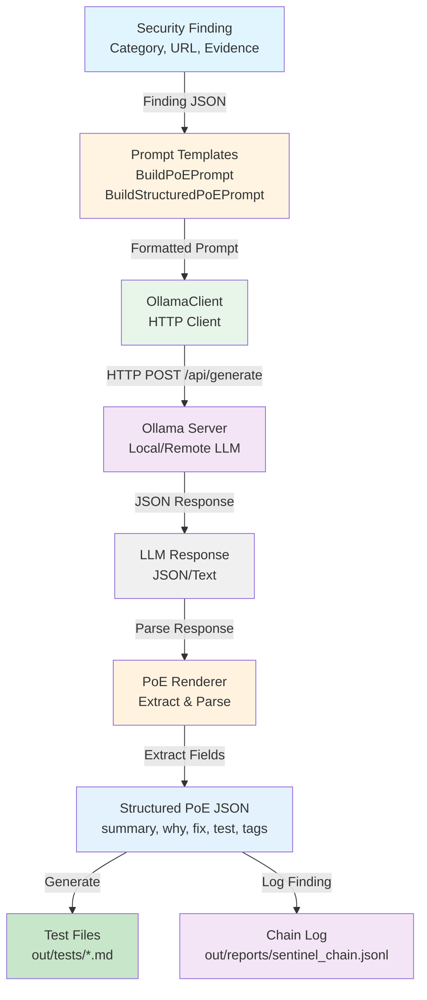

# Sentinel LLM Integration

Sentinel integrates with Large Language Models (LLMs) via Ollama to enhance security testing with intelligent test variation generation and Proof-of-Exploit (PoE) explanations.

## Overview

The LLM module enhances Sentinel's vulnerability detection by:
- **Generating test variations**: Creating diverse payloads and test cases from discovered inputs
- **Proof-of-Exploit (PoE) generation**: Producing human-readable explanations with remediation steps
- **Safety scoring**: Evaluating input safety before testing

## Architecture

The following diagram illustrates how the LLM module integrates with Sentinel's scanning pipeline:



**Data Flow:**
1. **Security Finding** is detected by Sentinel's vulnerability engine
2. **Prompt Templates** format the finding into a structured prompt for the LLM
3. **OllamaClient** sends HTTP request to Ollama server
4. **Ollama Server** processes prompt and generates response
5. **LLM Response** is parsed and validated
6. **PoE Renderer** extracts structured fields (summary, why, fix, test, tags)
7. **Structured PoE** is used to generate test files and log to chain

## Installation

### Prerequisites

- Ollama installed and running
- A compatible LLM model (e.g., `llama3.2:3b-instruct-q4_0`, `llama3.1:8b`)

### Install Ollama

**macOS/Linux:**
```bash
curl -fsSL https://ollama.ai/install.sh | sh
```

**Windows:**
Download from https://ollama.ai/download

### Pull a Model

```bash
# Small, fast model (recommended for testing)
ollama pull llama3.2:3b-instruct-q4_0

# Larger, more capable model
ollama pull llama3.1:8b

# Alternative models
ollama pull mistral
ollama pull codellama
```

### Start Ollama Server

```bash
ollama serve
```

The server runs on `http://127.0.0.1:11434` by default.

### Configure Host (Optional)

If your Ollama server is on a different host/port:

```bash
export OLLAMA_HOST=http://192.168.1.100:11434
```

## Usage

### Command-Line Tool

The `sentinel_llm` CLI tool provides direct access to LLM functionality:

```bash
# Basic text generation
./build/apps/llm/sentinel_llm --model llama3.2:3b-instruct-q4_0 --prompt "Hello, world!"

# JSON output
./build/apps/llm/sentinel_llm --model llama3.2:3b-instruct-q4_0 --prompt "Generate a curl command" --json

# Custom timeout
./build/apps/llm/sentinel_llm --model llama3.2:3b-instruct-q4_0 --prompt "Test" --timeout-ms 30000
```

### Proof-of-Exploit Generation

The LLM module generates structured PoE explanations for security findings:

**Input (Finding JSON):**
```json
{
  "category": "missing_security_header",
  "url": "http://127.0.0.1:8080/",
  "method": "GET",
  "evidence": {
    "header_checked": "X-Frame-Options"
  }
}
```

**Output (Structured PoE):**
```json
{
  "summary": "Missing X-Frame-Options header",
  "why": "The API endpoint is vulnerable to Clickjacking attacks because it doesn't include the X-Frame-Options header",
  "fix": "Add the X-Frame-Options header with a value of 'DENY' to prevent clickjacking attacks",
  "test": "- Send request without X-Frame-Options header\n- Add X-Frame-Options header and send request\n- Verify response headers include X-Frame-Options",
  "tags": {
    "cwe": "CWE-693",
    "owasp": "A05: Security Misconfiguration"
  }
}
```

### Integration with Full Demo

The full demo script (`./tools/full_demo.sh`) includes LLM smoke tests:

```bash
./tools/full_demo.sh
```

This runs:
1. **LLM Smoke Test** - Basic connectivity check
2. **PoE Smoke Test** - Generates PoE for a sample finding
3. **Scanner Integration** - Uses LLM for test variation generation

## API Reference

### OllamaClient

Located in `src/llm/ollama_client.h`:

```cpp
class OllamaClient {
public:
    // Constructor - reads OLLAMA_HOST env var if host empty
    explicit OllamaClient(const std::string& host = "");
    
    // Check if server is reachable
    bool IsHealthy();
    
    // Generate text using specified model
    std::string Generate(
        const std::string& model,
        const std::string& prompt,
        const std::optional<nlohmann::json>& json_schema = std::nullopt,
        const std::chrono::milliseconds& timeout = std::chrono::milliseconds(5000),
        bool stream = false
    );
};
```

**Example:**
```cpp
#include "llm/ollama_client.h"

llm::OllamaClient client;
if (!client.IsHealthy()) {
    std::cerr << "Ollama server not reachable\n";
    return;
}

std::string response = client.Generate(
    "llama3.2:3b-instruct-q4_0",
    "Generate a curl command to test XSS",
    std::nullopt,
    std::chrono::milliseconds(10000)
);
```

### Prompt Templates

Located in `src/llm/prompt_templates.h`:

**BuildPoEPrompt** - Creates prompt for basic PoE generation:
```cpp
std::string prompt = llm::BuildPoEPrompt(finding_json);
```

**BuildStructuredPoEPrompt** - Creates prompt for structured JSON PoE:
```cpp
std::string prompt = llm::BuildStructuredPoEPrompt(finding_json);
```

**BuildSafetyScorePrompt** - Creates prompt for safety scoring:
```cpp
std::string prompt = llm::BuildSafetyScorePrompt(input_snippet);
```

### PoE Renderer

Located in `src/llm/poe_renderer.h`:

**RenderPoE** - Extracts PoE command from LLM response:
```cpp
std::string poe_command = llm::RenderPoE(llm_response_json);
```

Handles various response formats:
- Direct JSON with `reproducer` field
- Ollama format with nested `response` field
- Plain text fallback

## Configuration

### Timeouts

Default timeout is 5 seconds. Configure via CLI:

```bash
--timeout-ms 30000  # 30 seconds
```

Or programmatically:

```cpp
client.Generate(model, prompt, std::nullopt, std::chrono::milliseconds(30000));
```

### Adaptive Timeouts

The client uses adaptive timeouts:
- **Connection timeout**: 5 seconds
- **Write timeout**: 30 seconds
- **Read timeout**: `max(timeout_opt, 10s)` or 30s default

### Retries

Default retry policy:
- **Max retries**: 1
- **Retry on**: Connection failures only
- **No retry on**: Read/write timeouts, HTTP errors

## Error Handling

The client throws `std::runtime_error` on:

- **Connection failures**: "ollama: connection failure"
- **Read timeouts**: "ollama: read timeout"
- **Write timeouts**: "ollama: write timeout"
- **HTTP errors**: "ollama: HTTP 404" (for status >= 400)
- **Request canceled**: "ollama: request canceled"

**Example:**
```cpp
try {
    std::string response = client.Generate(model, prompt);
} catch (const std::runtime_error& e) {
    std::cerr << "LLM error: " << e.what() << "\n";
}
```

## Testing

### Unit Tests

Run LLM-specific tests:

```bash
# Run all LLM tests
ctest -R "(ollama|poe|llm)" -V

# Run specific test binary
./build/test_ollama_client -r console -s
./build/test_poe_renderer -r console -s
```

### Smoke Tests

The demo script includes smoke tests:

```bash
./tools/full_demo.sh
```

**Expected output:**
```
=== LLM Smoke Test ===
{
  "response": "Sentinel LLM OK"
}

=== PoE Smoke Test ===
Finding: Missing X-Frame-Options header
Why: The API endpoint is vulnerable to Clickjacking attacks...
Fix: Add the X-Frame-Options header with a value of 'DENY'...
Test: - Send request without X-Frame-Options header...
CWE: CWE-693 | OWASP: A05: Security Misconfiguration
```

## Troubleshooting

### "Ollama not reachable"

**Check if Ollama is running:**
```bash
curl http://127.0.0.1:11434/api/tags
```

**Start Ollama:**
```bash
ollama serve
```

**Check environment variable:**
```bash
echo $OLLAMA_HOST
export OLLAMA_HOST=http://127.0.0.1:11434
```

### "Model not found"

**List available models:**
```bash
ollama list
```

**Pull the model:**
```bash
ollama pull llama3.2:3b-instruct-q4_0
```

### "Read timeout"

**Increase timeout:**
```bash
./build/apps/llm/sentinel_llm --model llama3.2:3b-instruct-q4_0 --prompt "..." --timeout-ms 30000
```

**Check model size:** Smaller models respond faster. Consider using `llama3.2:3b-instruct-q4_0` instead of larger models.

### "Invalid JSON response"

The PoE renderer handles various response formats. If you see JSON parsing errors:

1. Check LLM response format matches expected structure
2. Verify model supports JSON output
3. Check prompt template includes JSON structure instructions

### "Connection refused"

**Check firewall/network:**
```bash
# Test connectivity
curl -v http://127.0.0.1:11434/api/tags

# Check if port is listening
netstat -an | grep 11434  # Linux
lsof -i :11434             # macOS
```

## Limitations

- **No streaming support**: The `stream` parameter exists but streaming responses are not fully implemented
- **JSON schema support**: Depends on Ollama model capabilities
- **Single request/response**: No conversation context maintained between requests
- **Model dependency**: Quality of PoE generation depends on the selected model

## Best Practices

1. **Use appropriate models**: Smaller models (`llama3.2:3b-instruct-q4_0`) for fast testing, larger models for better quality
2. **Set reasonable timeouts**: 10-30 seconds for most use cases
3. **Handle errors gracefully**: Always wrap LLM calls in try-catch blocks
4. **Validate responses**: Check LLM output before using in production
5. **Cache results**: Consider caching PoE results for identical findings

## Examples

### Generate PoE for a Finding

```cpp
#include "llm/ollama_client.h"
#include "llm/prompt_templates.h"
#include "llm/poe_renderer.h"

nlohmann::json finding = {
    {"category", "missing_security_header"},
    {"url", "http://example.com"},
    {"method", "GET"},
    {"evidence", {{"header_checked", "X-Frame-Options"}}}
};

llm::OllamaClient client;
std::string prompt = llm::BuildStructuredPoEPrompt(finding);
std::string response = client.Generate("llama3.2:3b-instruct-q4_0", prompt);

// Parse response
auto poe_json = nlohmann::json::parse(response);
std::string summary = poe_json["summary"];
std::string test = poe_json["test"];
```

### Check Server Health

```cpp
llm::OllamaClient client;
if (client.IsHealthy()) {
    std::cout << "Ollama server is ready\n";
} else {
    std::cerr << "Ollama server not reachable\n";
}
```

## Integration Points

The LLM module integrates with Sentinel at these points:

1. **Test Variation Generation**: Uses `inputs.jsonl` to generate diverse test cases
2. **PoE Generation**: Enhances findings with explanations and remediation steps
3. **Safety Scoring**: Evaluates input safety before testing (future enhancement)

See the main [README.md](README.md) for the complete architecture diagram showing LLM integration within the full Sentinel pipeline.

