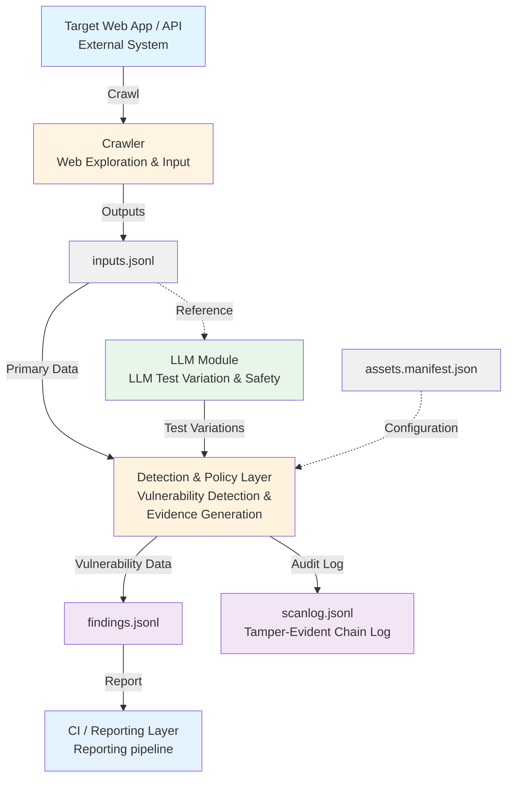

# Sentinel

Sentinel is a comprehensive Dynamic Application Security Testing (DAST) system designed for web applications and APIs. It provides automated security scanning with intelligent vulnerability detection, verifiable proof-of-exploit generation, seamless CI/CD integration, and LLM-assisted test payload generation. Sentinel helps security teams identify and remediate security issues before they reach production.

## Key Features

- **Comprehensive Vulnerability Detection**: Identifies security headers misconfigurations, unsafe cookies, CORS issues, XSS, CSRF, IDOR, SQL injection, command injection, path traversal, SSRF, XXE, SSTI, sensitive data exposure, information disclosure, open redirects, directory listings, and dangerous HTTP methods
- **Authenticated Scanning**: Supports form-based, API-based (bearer tokens/API keys), and OAuth authentication for testing protected endpoints
- **Advanced Analysis**: Includes response pattern analysis, timing-based blind injection detection, and baseline comparison for behavioral anomaly detection
- **Tamper-Evident Audit Logging**: Hash-chained log files ensure scan integrity and provide audit trails for compliance
- **Risk Budget Management**: Configurable risk scoring and thresholds for CI/CD gating
- **LLM Integration**: Optional integration with Ollama for intelligent test variation generation and proof-of-exploit explanations
- **Reproducible Findings**: Generates fully functional Catch2 test cases and shell scripts for each discovered vulnerability, ready for CI/CD integration

## Architecture

The following diagram illustrates Sentinel's security scanning and reporting pipeline:



**Data Flow:**
1. **Crawler** explores the target web application/API and outputs discovered endpoints to `inputs.jsonl`
2. **LLM Module** uses `inputs.jsonl` as reference to generate safe test variations (dashed arrow = reference/configuration)
3. **Detection & Policy Layer** receives:
   - Primary data from `inputs.jsonl` (solid arrow)
   - Test variations from LLM Module (solid arrow)
   - Configuration from `assets.manifest.json` (dashed arrow = configuration)
4. **Detection & Policy Layer** outputs:
   - `findings.jsonl` - Detailed vulnerability findings
   - `scanlog.jsonl` - Tamper-evident hash-chained audit log
5. **CI/Reporting Layer** consumes `findings.jsonl` for integration and reporting

**Key Components:**
- **inputs.jsonl**: Raw crawl results (discovered URLs, forms, endpoints)
- **findings.jsonl**: Processed security findings with evidence
- **scanlog.jsonl**: Tamper-evident chain log (corresponds to `out/reports/sentinel_chain.jsonl`)
- **assets.manifest.json**: Configuration manifest for detection policies

## Build Instructions

### Prerequisites
- CMake ≥ 3.18
- C++17 compiler
- libcurl development headers and library installed
- gumbo-parser (HTML parsing)
- nlohmann/json (JSON handling)
- libssl development headers and library installed
- jq, curl (for demo scripts)
- Ollama (for LLM features)

On Debian/Ubuntu:
```bash
sudo apt install build-essential cmake libcurl4-openssl-dev libgumbo-dev nlohmann-json3-dev libssl-dev jq curl
```

On macOS:
```bash
brew install cmake gumbo-parser nlohmann-json openssl jq curl
```

### Build
```bash
cmake -S . -B build -DCMAKE_BUILD_TYPE=Release
cmake --build build
```

## Running the Demo

### Quick Start: Full Demo Script

The easiest way to see Sentinel in action is to run the full demo script, which performs an end-to-end demonstration:

```bash
./tools/full_demo.sh
```

Or specify a custom Ollama model:
```bash
./tools/full_demo.sh llama3.1:8b
```

**Prerequisites:**
- Ollama must be running (either via `ollama serve` or Ollama.app)
- Set `OLLAMA_HOST` environment variable if using a non-default location:
  ```bash
  export OLLAMA_HOST=http://127.0.0.1:11434
  ```

**What the Demo Does:**

1. **Ollama Models** - Lists available LLM models
2. **LLM Smoke Test** - Tests basic LLM connectivity with a simple prompt
3. **PoE Smoke Test** - Generates a Proof-of-Exploit (PoE) explanation for a sample finding
4. **Demo Server Test** - Starts a local demo server with intentionally insecure endpoints
5. **Scanner Test (Insecure)** - Scans the insecure endpoint and generates findings
6. **Secure Scanner Test** - Scans a secure endpoint for comparison
7. **Comparison** - Shows side-by-side comparison of secure vs insecure results

**Understanding the Output:**

```
=== Scanner Test (Insecure Endpoint) ===
Starting scan: run_20251114_012839
Target: http://127.0.0.1:8080
Crawling...
Finished crawl.
Generating findings...
Generated 8 findings
Generating reproduction artifacts...
  ✓ repro.sh
  ✓ repro_run_20251114_012839.cpp
Generating test files...
  ✓ 8 test file(s) in out/tests/
  Log verified: 17 entries, chain intact
Total risk points: 17 (warn: 5, block: 10)
```

**What this means:**
- **Generated 8 findings**: The scanner found 8 security issues
- **repro.sh**: Shell script to reproduce each finding
- **repro_*.cpp**: C++ test harness for automated testing
- **8 test file(s)**: Markdown files in `out/tests/` with test commands and remediation steps
- **Log verified**: Tamper-evident chain log verified successfully
- **Total risk points**: Risk score calculated from findings (17 points exceeds block threshold of 10)
- **Exit code**: 2 = BLOCK (risk exceeds threshold), 1 = WARN, 0 = PASS

**Exit Codes:**
- `0` = PASS: No findings or risk within acceptable limits
- `1` = WARN: Findings present but risk below block threshold
- `2` = BLOCK: Risk exceeds block threshold (should fail CI/CD)
- `3` = FATAL: Critical error (network failure, parsing error, etc.)

**Generated Files:**

After running the demo, you'll find:

- **`runlogs/`** - Demo execution logs with timestamps
  - `llm_smoke-*.json` - LLM smoke test responses
  - `poe_smoke-*.json` - PoE generation results
  - `demo_server-*.log` - Demo server logs

- **`artifacts/`** - Reproduction artifacts
  - `repro.sh` - Shell script to reproduce findings
  - `repro_<run_id>.cpp` - C++ test harness
  - `vuln_findings.jsonl` - All findings in JSONL format
  - `scan_results.jsonl` - Raw crawl results

- **`out/tests/`** - Per-finding test files
  - `finding_<id>.md` - Markdown files with:
    - Target URL
    - Test command (bash snippet)
    - Remediation instructions

- **`out/reports/`** - Tamper-evident logs
  - `sentinel_chain.jsonl` - Hash-chained log of all findings (tamper detection)

### Manual Command-Line Usage

#### Basic Scan

Scan a target URL:

```bash
./build/sentinel scan --target http://example.com
```

**Output:**
```
Starting scan: run_20251114_012839
Target: http://example.com
Crawling...
Finished crawl.
Generating findings...
Generated 8 findings
Generating reproduction artifacts...
  ✓ repro.sh
  ✓ repro_run_20251114_012839.cpp
Generating test files...
  ✓ 8 test file(s) in out/tests/
  Log verified: 8 entries, chain intact
Total risk points: 17 (warn: 5, block: 10)
```

**What happens:**
1. **Crawling**: The crawler explores the target application by following links, parsing HTML forms, and discovering endpoints. It respects robots.txt and can use OpenAPI specifications to discover additional API endpoints.
2. **Generating findings**: The vulnerability engine analyzes each discovered endpoint for multiple security issues including:
   - Missing or misconfigured security headers (X-Frame-Options, CSP, HSTS, etc.)
   - Unsafe cookie settings (missing HttpOnly, Secure, SameSite flags)
   - CORS misconfigurations (overly permissive origins)
   - Reflected XSS vulnerabilities
   - Missing CSRF protection
   - Insecure direct object references (IDOR)
   - Information disclosure (stack traces, internal paths, version info)
   - Open redirect vulnerabilities
   - Directory listing exposures
   - Dangerous HTTP method exposures (PUT, DELETE, TRACE, PATCH)
3. **Generating artifacts**: Creates reproduction scripts (shell and C++), test files with remediation steps, and structured finding data
4. **Chain logging**: Each finding is logged to a tamper-evident hash-chained log file for audit and compliance purposes
5. **Budget evaluation**: Calculates risk score based on severity and category weights, then determines exit code based on configured thresholds

#### Scan with OpenAPI Specification

If you have an OpenAPI spec, you can provide it to discover more endpoints:

```bash
./build/sentinel scan --target http://api.example.com --openapi openapi.json
```

#### Custom Output File

Save crawl results to a specific file:

```bash
./build/sentinel scan --target http://example.com --out my_scan.jsonl
```

#### Verify Chain Log Integrity

Check if the chain log has been tampered with:

```bash
./build/sentinel verify out/reports/sentinel_chain.jsonl
```

**Output:**
```
Verifying log: out/reports/sentinel_chain.jsonl
  Log verified: 17 entries, chain intact
```

If tampering is detected:
```
Verifying log: out/reports/sentinel_chain.jsonl
  Hash mismatch at entry 5
  Expected: sha256:abc123...
  Computed: sha256:def456...
Verification failed
```

#### Evaluate Budget Compliance

Check if findings comply with risk budget policy:

```bash
./build/sentinel budget --policy config/policy.yaml out/reports/sentinel_chain.jsonl
```

**Output:**
```
=== Risk Budget Report ===

Findings by Category:
  missing_security_header    Count:   5 Score: 10
  unsafe_cookie              Count:   2 Score: 2
  cors_misconfiguration      Count:   1 Score: 3

Total Score: 15
Status: BLOCK

   BLOCKED: Risk score exceeds threshold
```

### Understanding Test Files

Each finding generates a markdown test file in `out/tests/<finding_id>.md`:

```markdown
# Test: missing_security_header

**Finding ID:** finding_1

**Target URL:** http://127.0.0.1:8080/

**Severity:** medium

**Category:** missing_security_header

## Test Command

```bash
curl -s -D - http://127.0.0.1:8080/ | grep -iE '^X-Frame-Options:'
```

## Remediation

Add the `X-Frame-Options` header to responses.

Example: `X-Frame-Options: DENY` or `X-Frame-Options: SAMEORIGIN`
```

These files provide:
- **Test Command**: Copy-pasteable bash command to verify the issue
- **Remediation**: Specific steps to fix the vulnerability

### Understanding Chain Logs

The chain log (`out/reports/sentinel_chain.jsonl`) is a tamper-evident append-only log. Each entry includes:

- `event_type`: Type of event (e.g., "finding_recorded")
- `timestamp`: ISO8601 UTC timestamp
- `prev_hash`: Hash of previous entry (creates the chain)
- `entry_hash`: Hash of this entry's content
- `payload`: Finding data

**Why it matters:** If someone modifies or deletes entries, the hash chain breaks and verification fails. This is useful for audit trails and compliance.

### Demo Server

The demo includes a test server with intentionally insecure endpoints:

```bash
./build/apps/demo_server/demo_server
```

**Endpoints:**
- `http://127.0.0.1:8080/` - Insecure endpoint (missing headers, unsafe cookies)
- `http://127.0.0.1:8080/secure` - Secure endpoint (all headers present, secure cookies)

Use these to test the scanner and see the difference between secure and insecure configurations.

## Vulnerability Detection Capabilities

Sentinel's vulnerability engine performs comprehensive security analysis across multiple categories:

### Security Headers
- Checks for presence and correct configuration of security headers (X-Frame-Options, CSP, HSTS, X-Content-Type-Options, etc.)
- Validates header values for security best practices

### Cookie Security
- Detects missing HttpOnly, Secure, and SameSite flags
- Identifies overly broad cookie scopes

### CORS Configuration
- Tests for overly permissive Access-Control-Allow-Origin settings
- Validates CORS header combinations

### Injection Vulnerabilities
- **Reflected XSS**: Tests for cross-site scripting vulnerabilities with payload reflection detection
- **SQL Injection**: Comprehensive detection using multiple methods:
  - Error-based detection (MySQL, PostgreSQL, SQL Server, Oracle)
  - Time-based blind injection (SLEEP payloads)
  - Boolean-based blind injection (response comparison)
  - Database type identification
  - Bypass technique testing (encoding, comments)
- **Command Injection**: Detects OS command execution vulnerabilities:
  - Command output detection in responses
  - Time-based blind detection (sleep commands)
  - Multiple command separator testing (;, |, &, $(cmd), backticks)
  - Unix and Windows payload support
  - OS type identification
- **Path Traversal**: Detects directory traversal vulnerabilities:
  - File content detection (/etc/passwd, win.ini, etc.)
  - Encoded traversal variants (URL encoded, double encoded)
  - Null byte injection for extension bypass
  - Unicode and alternative traversal sequences
  - OS type identification
- **Server-Side Request Forgery (SSRF)**: Detects SSRF vulnerabilities:
  - Internal IP address testing (127.0.0.1, 169.254.169.254, private ranges)
  - Internal hostname testing (localhost, metadata endpoints)
  - Cloud metadata endpoint detection (AWS, GCP, Azure)
  - Protocol handler testing (file://, gopher://, dict://)
  - Internal content detection
  - **Out-of-band (OOB) detection**: When callback URL is configured, injects callback URLs with unique tokens to detect blind SSRF vulnerabilities
- **XML External Entity (XXE)**: Detects XXE vulnerabilities:
  - Classic XXE file disclosure
  - **Blind XXE via out-of-band callbacks**: When callback URL is configured, uses callback URLs instead of placeholder "attacker.com" in blind XXE payloads
  - Parameter entity exploitation
  - SSRF via XXE
  - Multiple encoding support
- **Server-Side Template Injection (SSTI)**: Detects template injection vulnerabilities:
  - Support for major template engines (Jinja2, Twig, Freemarker, Velocity, Smarty, Mako, ERB, JSP, ASP.NET, Handlebars)
  - Template evaluation detection (mathematical operations)
  - Template engine identification
  - Multiple injection point testing (URL params, POST body, headers)

### Authentication & Authorization
- **CSRF**: Identifies missing CSRF protection on state-changing operations
- **Enhanced IDOR**: Advanced insecure direct object reference detection:
  - Multi-session testing (User A's resources with User B's session)
  - Resource ID identification in URLs, parameters, and request bodies
  - Numeric ID enumeration testing
  - UUID/GUID guessing where applicable
  - Cross-tenant access detection
  - Baseline comparison to verify data differences
  - Proper authorization verification (no false positives on 403/404)

### Information Disclosure
- Detects stack traces (Java, .NET, Python, PHP, Node.js, Ruby)
- Identifies internal file paths and private IP addresses
- Finds exposed version information in headers and responses
- Detects debug mode indicators
- **Sensitive Data Exposure**: Detects sensitive information in responses:
  - PII patterns (SSN, credit card numbers, phone numbers)
  - Credential patterns (passwords, API keys, JWT tokens, OAuth tokens)
  - Sensitive field names in JSON/XML responses
  - Context-aware detection to reduce false positives
  - Excessive data exposure detection (over-fetching)

### Open Redirects
- Tests common redirect parameters with external domain payloads
- Detects both HTTP and JavaScript-based redirects
- Tests bypass techniques (protocol-relative URLs, encoded slashes)

### Directory Listings
- Detects Apache, Nginx, and IIS directory listings
- Identifies sensitive files in exposed directories
- Differentiates between raw listings and custom file browsers

### HTTP Method Vulnerabilities
- Tests OPTIONS to enumerate allowed methods
- Verifies functionality of dangerous methods (PUT, DELETE, TRACE, PATCH)
- Only reports methods that are actually functional (not just listed)

### Advanced Analysis
- **Response Pattern Analysis**: Automatically detects SQL errors, command output, stack traces, and debug information
- **Timing Analysis**: Establishes baselines and detects timing anomalies for blind injection detection
- **Baseline Comparison**: Compares normal vs. payload-injected responses to detect behavioral differences

## Session Management

Sentinel supports authenticated scanning of web applications that require login. The Session Management module handles authentication credentials and maintains authenticated sessions throughout scans, enabling comprehensive testing of protected endpoints.

### Features

- **Form-based authentication**: Automatically parses login forms, extracts CSRF tokens, and submits credentials
- **API-based authentication**: Supports bearer tokens and API keys
- **OAuth authentication**: Supports OAuth 2.0 client credentials flow
- **Session persistence**: Automatically injects session cookies and tokens into subsequent requests
- **Automatic re-authentication**: Detects session expiration (401/403 responses) and re-authenticates automatically
- **Multi-user support**: Maintains separate sessions for multiple users for role-based testing

### Configuration

Create a `config/auth_config.yaml` file to configure authentication:

```yaml
# Authentication configuration for Sentinel
users:
  # Form-based authentication
  - user_id: "admin"
    auth_type: "form_based"
    username: "admin"
    password: "admin123"
    login_url: "http://127.0.0.1:8080/login"

  # Bearer token authentication
  - user_id: "api_user"
    auth_type: "api_bearer"
    token: "your_bearer_token_here"
    api_endpoint: "https://api.example.com/validate"

  # API key authentication
  - user_id: "api_key_user"
    auth_type: "api_key"
    token: "your_api_key_here"
    api_endpoint: "https://api.example.com/validate"
    header_X-API-Key: "${token}"  # Custom header with token placeholder

  # OAuth authentication
  - user_id: "oauth_user"
    auth_type: "oauth"
    oauth_client_id: "your_client_id"
    oauth_client_secret: "your_client_secret"
    oauth_token_url: "https://oauth.example.com/token"
    oauth_scope: "read write"
```

### Usage Examples

#### Using SessionManager in Code

```cpp
#include "core/session_manager.h"
#include "core/http_client.h"
#include "core/vuln_engine.h"

// Create HTTP client
HttpClient::Options opts;
HttpClient client(opts);

// Create session manager
SessionManager session_manager(client);

// Load configuration
session_manager.load_config("config/auth_config.yaml");

// Authenticate a user
Credentials creds;
creds.auth_type = AuthType::FORM_BASED;
creds.username = "admin";
creds.password = "admin123";
creds.login_url = "http://127.0.0.1:8080/login";

if (session_manager.authenticate("admin", creds)) {
    std::cout << "Authentication successful!" << std::endl;

    // Get cookies for requests
    auto cookies = session_manager.get_cookies("admin");

    // Get auth headers
    auto headers = session_manager.get_auth_headers("admin");
}

// Use with VulnEngine for authenticated scanning
VulnEngine engine(client, 0.7, &session_manager);
// VulnEngine will automatically inject session cookies/headers into requests
```

#### Form-based Authentication Flow

1. **Fetch login page**: SessionManager fetches the login form
2. **Extract CSRF token**: Automatically finds CSRF tokens in hidden form fields or meta tags
3. **Submit credentials**: POSTs username, password, and CSRF token
4. **Extract session cookies**: Parses Set-Cookie headers and stores them
5. **Inject cookies**: Subsequent requests automatically include session cookies

#### API-based Authentication

For bearer token or API key authentication:

```cpp
Credentials creds;
creds.auth_type = AuthType::API_BEARER;
creds.token = "your_token_here";

session_manager.authenticate("api_user", creds);

// All subsequent requests will include: Authorization: Bearer your_token_here
```

#### Multi-user Session Management

Maintain separate sessions for different users:

```cpp
// Authenticate admin user
Credentials admin_creds;
admin_creds.auth_type = AuthType::FORM_BASED;
admin_creds.username = "admin";
admin_creds.password = "admin123";
admin_creds.login_url = "http://example.com/login";
session_manager.authenticate("admin", admin_creds);

// Authenticate regular user
Credentials user_creds;
user_creds.auth_type = AuthType::FORM_BASED;
user_creds.username = "user";
user_creds.password = "user123";
user_creds.login_url = "http://example.com/login";
session_manager.authenticate("user", user_creds);

// Switch between sessions
auto admin_cookies = session_manager.get_cookies("admin");
auto user_cookies = session_manager.get_cookies("user");
```

#### Session Expiration Handling

SessionManager automatically detects expired sessions and re-authenticates:

```cpp
// Make a request
HttpRequest req;
req.url = "http://example.com/protected";
HttpResponse resp;
client.perform(req, resp);

// Check if session expired
if (resp.status == 401 || resp.status == 403) {
    // SessionManager will automatically re-authenticate if handle_session_expiration is called
    session_manager.handle_session_expiration("admin", resp, admin_creds);

    // Retry the request
    client.perform(req, resp);
}
```

### Integration with VulnEngine

VulnEngine automatically uses SessionManager when provided:

```cpp
HttpClient client(opts);
SessionManager session_manager(client);
session_manager.load_config("config/auth_config.yaml");

// Authenticate before scanning
Credentials creds;
// ... configure creds ...
session_manager.authenticate("admin", creds);

// Create VulnEngine with session manager
VulnEngine engine(client, 0.7, &session_manager);

// All vulnerability checks will use authenticated sessions
auto findings = engine.analyze(crawl_results);
```

### Testing

Run the session manager tests:

```bash
cd build
ctest -R test_session_manager -V
```

Or run the full test suite:

```bash
make test
```

### Demo Server Login Endpoint

The demo server includes a login endpoint for testing:

```bash
# Start demo server
./build/apps/demo_server/demo_server

# Login endpoint: http://127.0.0.1:8080/login
# Protected endpoint: http://127.0.0.1:8080/protected
```

Example authentication flow:

1. GET `/login` - Returns login form with CSRF token
2. POST `/login` - Submits credentials, returns session cookie
3. GET `/protected` - Requires session cookie, returns protected content

## Configuration

### Out-of-Band (OOB) Detection

Sentinel supports out-of-band detection for blind SSRF and XXE vulnerabilities. When a callback URL is configured, Sentinel injects unique callback URLs with tokens into payloads and verifies if the target server makes requests to the callback URL.

**Configuration** (`config/scanner.yaml`):

```yaml
# Out-of-band (OOB) detection configuration
# Optional callback URL for detecting blind SSRF and XXE vulnerabilities
callback_url: "https://webhook.site/unique-uuid-here"  # Use webhook.site for automatic verification
# OR
callback_url: "http://your-server.com/callback"        # Use custom callback server (manual verification)
# OR
callback_url: ""  # Leave empty to disable OOB detection (default)
```

**Using webhook.site (Recommended)**:

1. Visit https://webhook.site and copy your unique URL (e.g., `https://webhook.site/abc123-def456-...`)
2. Add it to `config/scanner.yaml`:
   ```yaml
   callback_url: "https://webhook.site/abc123-def456-..."
   ```
3. Run your scan - Sentinel will automatically verify callbacks via webhook.site's API

**Using a Custom Callback Server**:

1. Set up a server that logs incoming HTTP requests
2. Add the callback URL to `config/scanner.yaml`:
   ```yaml
   callback_url: "http://your-server.com/callback"
   ```
3. Run your scan - Sentinel will note in findings that manual verification is required
4. Check your server logs for requests containing `token=sentinel_...` parameters

**How It Works**:

1. Sentinel generates unique tokens (format: `sentinel_{timestamp}_{random}`)
2. Injects callback URLs with tokens into SSRF and XXE payloads
3. After sending payloads, waits 3 seconds for callbacks
4. For webhook.site URLs: Automatically queries the API to verify callbacks
5. For custom URLs: Adds a note in findings for manual verification
6. Creates findings with `detection_method: "out-of-band"` when callbacks are verified

**Example Finding**:

```json
{
  "category": "ssrf",
  "detection_method": "out-of-band",
  "callback_url": "https://webhook.site/abc123",
  "token": "sentinel_1234567890_5678",
  "confidence": 0.90
}
```

**Note**: OOB detection is optional. Sentinel works normally without a callback URL configured, using only in-band detection methods.

### Risk Budget Policy

Edit `config/policy.yaml` to configure risk thresholds:

```yaml
risk_budget:
  max_points: 10
  weights:
    low: 1
    medium: 2
    high: 4
    critical: 8

category_scores:
  missing_security_header: 2
  unsafe_cookie: 1
  cors_misconfiguration: 3
  reflected_xss: 5
  csrf: 4
  idor: 8
  sql_injection: 10
  command_injection: 10
  path_traversal: 6
  ssrf: 9
  xxe: 9
  ssti: 10
  sensitive_data_exposure: 7

warn_threshold: 3
block_threshold: 5
```

- **max_points**: Maximum acceptable risk score
- **weights**: Points per severity level
- **category_scores**: Points per finding category
- **warn_threshold**: Score threshold for warnings
- **block_threshold**: Score threshold for blocking CI/CD

## Troubleshooting

### "Ollama not reachable"

Make sure Ollama is running:
```bash
ollama serve
```

Or check if it's running on a different host:
```bash
export OLLAMA_HOST=http://your-host:11434
```

### "Error parsing policy file"

The policy file supports both JSON and YAML formats. If you see parsing errors, check:
- File syntax is valid YAML or JSON
- File path is correct (default: `config/policy.yaml`)

### "Chain verification failed"

This means the chain log has been modified. Possible causes:
- Manual editing of `sentinel_chain.jsonl`
- File corruption
- Concurrent writes (shouldn't happen in normal operation)

If verification fails, the log should be considered compromised and a new scan should be run.

## Vulnerability Detection Details

### How Sentinel Detects Vulnerabilities

Sentinel uses a multi-layered approach to vulnerability detection:

1. **Static Analysis**: Examines HTTP headers, cookies, and response structure
2. **Pattern Matching**: Uses regex patterns to detect error messages, stack traces, and sensitive information
3. **Behavioral Analysis**: Compares baseline responses against payload-injected responses
4. **Timing Analysis**: Detects blind injection vulnerabilities by measuring response time anomalies
5. **Functional Testing**: Verifies that dangerous HTTP methods actually work, not just that they're listed

### Detection Confidence

Each finding includes a confidence score (0.0-1.0) that indicates how certain Sentinel is about the vulnerability:

- **High (0.9-1.0)**: Clear evidence, unambiguous vulnerability
- **Medium (0.7-0.89)**: Strong indicators, likely vulnerability
- **Low (0.5-0.69)**: Possible vulnerability, requires manual verification

Findings below the configured confidence threshold (default 0.7) are filtered out to reduce false positives.

### False Positive Prevention

Sentinel includes several mechanisms to minimize false positives:

- **Confidence Thresholds**: Only reports findings above a configurable confidence level
- **Context Validation**: Checks surrounding context before flagging patterns (e.g., HTML comments)
- **Functional Verification**: Tests that vulnerabilities actually work, not just that they're theoretically possible
- **Custom Page Detection**: Differentiates between raw directory listings and styled file browsers
- **Whitelist Validation**: Recognizes when redirects are properly validated against whitelists

## Generated Test Artifacts

Sentinel generates fully functional Catch2 test cases that can be compiled and executed without modification. These tests are designed for CI/CD integration and automatic vulnerability verification.

### Test File Structure

Generated test files include:
- Complete Catch2 test harness with all necessary includes
- Actual HTTP client calls (not placeholders)
- REQUIRE() assertions for verification
- Helper functions for common checks (headers, cookies, CORS, injection patterns)
- Configurable target URL via `TARGET_URL` environment variable

### Using Generated Tests

1. **Compile the test file:**
   ```bash
   g++ -std=c++17 generated_tests.cpp -I. -lcurl -o test_vulnerabilities
   ```

2. **Set target URL (optional):**
   ```bash
   export TARGET_URL=http://example.com:8080
   ```

3. **Run tests:**
   ```bash
   ./test_vulnerabilities
   ```

### Test Helper Library

The `tests/helpers/http_test_helpers` library provides utility functions for:
- Parsing Set-Cookie headers and verifying cookie flags
- Checking security header presence and values
- Performing CORS preflight requests
- Detecting SQL errors, command output, and file content in responses
- Measuring response times for blind injection tests

### Test Categories

Generated tests verify:
- **Security Headers**: Checks for required headers (X-Frame-Options, CSP, etc.)
- **Cookie Security**: Verifies Secure, HttpOnly, and SameSite flags
- **CORS Configuration**: Tests for wildcard origin with credentials misconfiguration
- **SQL Injection**: Verifies no SQL errors in responses (or timing anomalies)
- **Command Injection**: Verifies no command output in responses
- **Path Traversal**: Verifies no sensitive file content exposure

## Next Steps

- Review findings in `artifacts/vuln_findings.jsonl`
- Compile and run generated Catch2 test files for automated verification
- Run test commands from `out/tests/*.md` files
- Check chain log integrity with `sentinel verify`
- Integrate into CI/CD pipeline using exit codes
- Configure authentication in `config/auth_config.yaml` for authenticated scanning
- Customize detection patterns in `config/response_patterns.yaml`
- Use multi-user session configuration for enhanced IDOR testing
